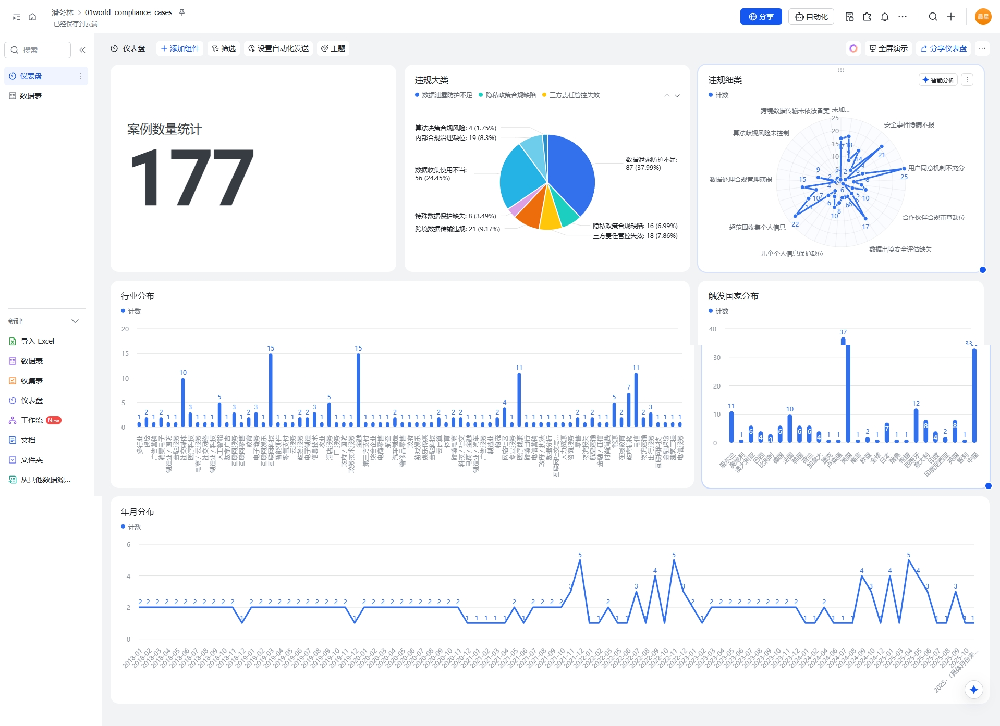

# world-compliance-cases

# 一、仓库定位
本仓库整合全球范围内的合规典型案例（覆盖数据安全、反垄断、ESG 合规等领域），为合规从业者、法务团队提供 “可检索、可参考、可复用” 的案例库，支持跨地区合规对比分析与内部培训素材使用。

# 二、目录结构

```
world-compliance-cases
README.md               # 仓库说明文档（本文档）
```

# 三、使用指南
## 1. 仓库获取
### 克隆仓库到本地

```
git clone https://gitee.com/evcgs/world-compliance-cases
```

## 2. 案例数据

- 分析看板：
- 明细数据：飞书链接：https://f5lfzip8kq.feishu.cn/wiki/J6snwZdnqiFnrcknftRcRbJ9nyb?from=from_copylink   密码：@1B19252

## 3. 数据提交/修改


## 4. 更新数据查看，后续数据会在群中更新


# 四、贡献规则

## 1. 贡献范围
- 新增合规案例（需包含 “背景 + 风险点 + 处理结果 + 行业启示”，来源需权威：监管机构公告 / 律所报告 / 企业合规白皮书）
- 优化现有案例（补充最新进展、修正信息误差）
- 完善辅助文档（如更新 compliance-glossary.md 术语、补充监管动态）

## 2. 贡献流程
- Fork 本仓库到个人账号
- 创建分支（分支命名规范：feature/add-case-[案例关键词] 或 fix/update-case-[案例ID]）
- 提交修改（提交信息格式：[操作类型]：具体内容，如 [新增]：添加2024欧盟GDPR处罚案例）
- 发起 Pull Request（PR），并在描述中说明 “贡献内容 + 案例来源链接”
- 等待仓库维护者审核（审核周期：[1-3 个工作日]），审核通过后合并至主分支

## 3. 内容规范
- 案例文件命名：年份.md（示例：2024.md）
- 案例内容需包含：
 - ① 案例背景（企业 / 行业 / 监管环境）
 - ② 合规风险点 
 - ③ 监管处理结果 / 企业应对措施 
 - ④ 来源链接（需可访问）

# 五、更新日志
- 版本：V0.0.3
-- 更新日期：2025-10-21
-- 更新内容：增加看板及飞书信息同步
-- 维护者：chenxing

- 版本：V0.0.2
-- 更新日期：2025-10-18
-- 更新内容：更新2018~2025数据
-- 维护者：chenxing

- 版本：V0.0.1
-- 更新日期：2025-10-15
-- 更新内容：创建
-- 维护者：chenxing

# 六、联系与支持
- 仓库维护者：潘冬林/晨星
- 联系邮箱：`evcgs@qq.com`
- 问题反馈：可直接在仓库发起 “Issue”，描述问题 / 需求（建议包含 “问题场景 + 期望效果”）

# 七、免责声明
- 本仓库收录的合规案例仅用于 “信息参考与学习研究”，不构成任何法律建议。
- 具体合规操作需结合企业实际情况，咨询专业法律机构后执行。
- 仓库维护者对案例内容的准确性、时效性不承担绝对担保责任，若发现误差可联系修正。

# 八、AI使用情况
- 采用AI进行基础信息收集
- 采用AI进行展示网页开发
- AI整理信息可能有误，尽管进行了事实性错误检查，不排除有其他错误，如有请反馈。

# 九、AI使用步骤
- 采用豆包进行信息收集；
- 收集信息用Trae分析整理；
- 网页代码由Trae执行开发。

